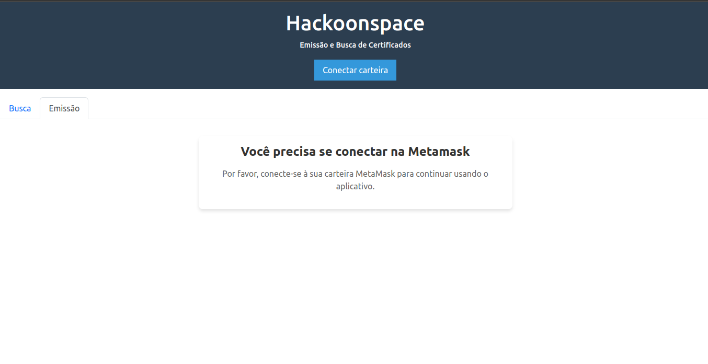
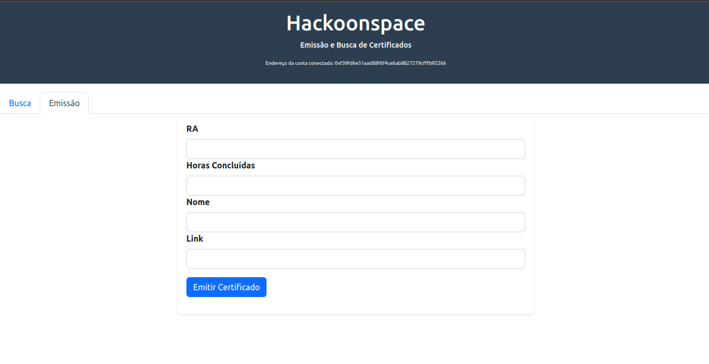
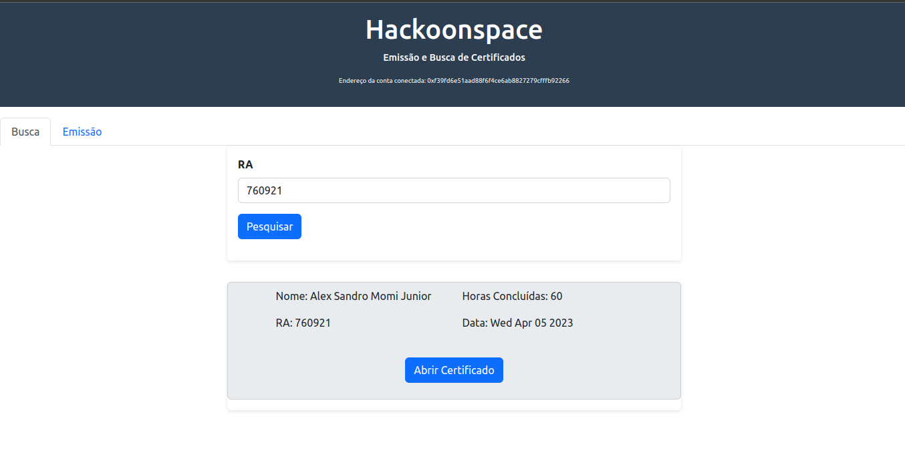

# Certificate Issuer

## Conceito do projeto
Atualmente o processo de validacão de créditos da Universidade é muito burocrático. Temos uma enorme dependência em papéis e documentos que muitas vezes perdemos ao longo do curso, tanto quanto, uma dependência na secretaria do curso para a validação dos créditos de todos os estudantes.

O intuito desse projecto é utilizar os contratos inteligentes da rede distribuída do Ethereum para válidar certificados da Universidade. Assim podemos garantir que o certificado foi emitido por uma entidade específica, e também, garantir que os documentos não serão perdidos, pois ficarão distríbuidos na rede para sempre.

Atualmente o projeto esta funcionando para uma única entidade (Hackoonspace), mas o objetivo é aprimora-lo para pode ser utilizado por qualquer entidade.

## Pré-requisitos e recursos utilizados
O projeto e as depêndencias são dividos em duas partes, backend e frontend respsctivamente. Para o backend nśo usamos Solidity para criação do contrato e Javascript e NodeJs(v16.19.1) para o script de teste e de deploy. Em relação aa depêndencias, é necessário instalar apenas a biblioteca `hardhat` que é responsável por permitir a criação de uma blockchain local.

Já para o frontend nós utilizamos React e algumas bibliotecas comuns para ajudar na criação da interface que podem ser instaladas através do comando `npm install`.

Por fim, será necessário possuir a Metamask instalada no navegador para conseguir testar a aplicação.

## Instalação
Primeiro certifique-se que tem o `Javascript` e o `Node` instalados na sua máquina. A versão do node utilizada no projeto é a `v16.19.1`.

_OBS: os passos a seguir são para executar o contrato em uma rede local, mas o intuito é oficializa-lo na rede oficial do Ethereum._

1 - **Instale as dependências**: garanta que está dentro da pasta raiz `/cerificate-issuer`, em seguida, instale as dependências dos módulos back-end e front-end;

``` bash
cd front-end
npm install

cd ../back-end
npm install
```


2- **Verifique se o projeto está funcionando corretamente**: para garantir que tudo está funcionando normalmente, dentro do caminho `/back-end`, execute o seguinte comando para compilar o contrato e realizar um teste de conexão com a Blockchain local.

``` bash
npx hardhat run scripts/run.js
```

Após rodar o comando deve aparecer um prompt similar a esse, podendo ter diferenças nos endereços printados.

```
Inicializando contrato.
Dono do contrato: 0xf39fd6e51aad88f6f4ce6ab8827279cfffb92266
Contract deployed to: 0x5FbDB2315678afecb367f032d93F642f64180aa3
Contract deployed by: 0xf39Fd6e51aad88F6F4ce6aB8827279cffFb92266
[
  [
    BigNumber { value: "760921" },
    BigNumber { value: "60" },
    'Projeto BlockChain 1.0',
    'https://drive.google.com/file/d/1FBYXtkKDeTElFe5sYTc7mJDKLEXq8jTP/view?usp=share_link',
    BigNumber { value: "1680270798" },
    RA: BigNumber { value: "760921" },
    hoursDone: BigNumber { value: "60" },
    name: 'Projeto BlockChain 1.0',
    link: 'https://drive.google.com/file/d/1FBYXtkKDeTElFe5sYTc7mJDKLEXq8jTP/view?usp=share_link',
    issueDate: BigNumber { value: "1680270798" }
  ],
  ...
]
```

## Execução

Para executar a aplicação localmente vá para pasta `/back-end` e siga os passos abaixo:

1- **Suba uma rede Ethereum local**: o comando abaixo irá subir a rede e printar uma lista de carteiras criadas pelo Hardhat, para conseguirmos testar o nosso contrato, e manterá uma rede local rodando enquanto o terminal não for finalizado.

``` bash
npx hardhat node
```

2- **Faça o deploy do contrato**: em outro terminal, continuando no caminho `/back-end`, execute o comando abaixo para fazer o deploy do contrato na rede local.

``` bash
npx hardhat run scripts/deploy.js --network localhost
```

3- **Faça a conexão entre a Metamask e a Blockchain local e adicione a carteira #0 da Blockchain de teste na Metamask**: isso pode ser feito seguindo esse tutorial [seguindo esse tutorial](https://medium.com/@kaishinaw/connecting-metamask-with-a-local-hardhat-network-7d8cea604dc6).

_OBS: quando for recriar a Blockchain local após realizar algumas operações será preciso resetar a Metamask, para isso siga os passos abaixo._

* _Dentro da Metamask, clique na sua foto;_
* _Va em Settings;_
* _Va em Advanced;_
* _Clique em Reset Account._


4- **Suba servidor do front-end**: esse comando irá subir a aplicação que se comunica com a rede Ethereum local em `http://localhost:5173/`.

```bash
cd ../front-end
npm run dev
```

### Como usar

A interface da aplicação é muito simples possuindo apenas duas abas principais, Busca e Emissão. Ao abrir a aplicação você verá uma tela muito similar a está:



Para conectar a carteira e conseguir realizar emissão ou busca de certificados clique no botão "Conectar Carteira" e confirme a operação na Metamask. Após isso, você poderá realizar a emissão ou busca de certificados a vontade, precisando apenas preencher os campos de cada aba.

<div style="text-align:center">
  <div><strong>Emissão de Certificados</strong></div>
  
</div>

<div style="text-align:center">
  <div><strong>Busca de Certificados</strong></div>
  
</div>


## Bugs/problemas conhecidos
Até o momento o projeto possui algumas limitações, como por exemplo a emissão do certificado que pode ser feita apenas pelo dono do contrato. No futuro vamos adicionar a funcionalidade para cadastrar outras entidades com essa permissão.


## Autores

| Nome do Autor | LinkedIn | GitHub |
| ------------- | -------- | ------ |
| Alex Sandro Momi Junior| [Alex Junior](https://www.linkedin.com/in/alexmomijunior/) | [AlexJunior01](https://github.com/AlexJunior01)
| João Victor Elias Costa  | [João Elias](https://www.linkedin.com/in/jvictore/) | [jvictore](https://github.com/jvictore)
